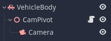
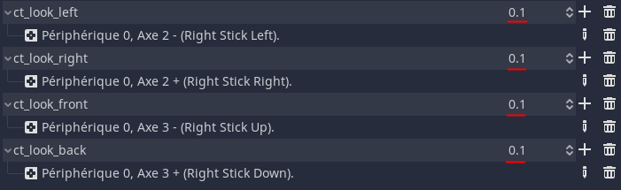

# Chasing camera for racing games

## Description

This script will provide you a "chasing" camera for your racing game.
It will act like AAA racing game's cameras (I took *Need for Speed 2015* as a reference). 

It will chase your vehicle depending of it's speed, and can be controlled by a joystick.

## How to implement it

- First add a "Spatial" node as a child of your car (it will act as a pivot)
- Next add a "Camera" node as a child of your pivot and tweak the **camera** to a "default position" (usually behind and above the car, and pointing a bit down)
- Then attach the script "camera_pivot.gd" to the Spatial node.

Here is what it should looks like :

 - Finnaly add the joystick controls in your project settings (don't forget to reduce the dead point)

 - Profit

If you click on the pivot you'll find 4 variables (I find the default values pretty fine):
Variable name           | Description
------------------------|-----------
Threshold Speed         | Minimum speed to activate the "chasing" mode
Auto Cam Speed          | Speed of the camera during "chasing" mode
Auto release Return     | speed of the camera to go behind the vehicle when it is stopped
Controller Smooth Speed | Speed of the camera when controlled by the joystick

## Known issues
 - When the vehicle is upside down the camera could shake and will not be oriented is the right direction
 - The tilt of the camera depending on the vertical velocity might be a bit off
 - I'm tired working on it so these issues will remain lol

---
---

This video served me as a starting point : https://youtu.be/zXLpitpFC6E